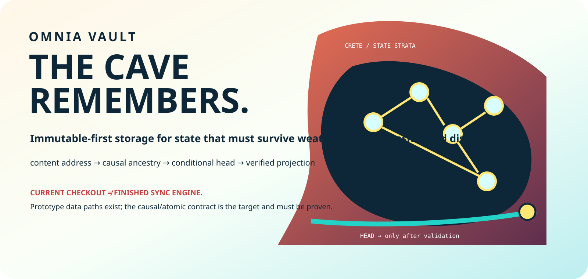

<p align="center">
  
</p>

<h1 align="center">OMNIA VAULT</h1>
<p align="center"><strong>NO ONE GETS TO QUIETLY REWRITE YESTERDAY.</strong></p>
<p align="center"><em>Identity outlives location. History deserves witnesses.</em></p>

<p align="center">
  <a href="https://blueshoes.space/rhea/">The Rhea family</a> ·
  <a href="docs/ARCHITECTURE_DEEP_DIVE.md">Architecture Deep Dive</a>
</p>

A cloud account should not own the only surviving version of your work. A sleeping laptop should not lose an argument merely because another machine has a newer clock.

**Omnia Vault is storage research aimed at giving bytes an identity, revisions an ancestry, and their owner a defensible answer to “what happened?”**

**On `main` today:** two separate prototypes—a Node/SQLite event store and a Rust supervisor with its own SQLite records and POSIX move/copy + symlink operations. The immutable causal synchronization engine described below is the target. The [deep dive](docs/ARCHITECTURE_DEEP_DIVE.md) explains the distance between them.

## Two laptops. One dangerous word: “latest.”

You and a friend start with the same project. You edit a chapter on a train. Your friend revises its opening at home. Both save while disconnected. When you meet, which file wins?

A timestamp can pick a winner. It cannot explain whether one version includes the other's work.

The design we want keeps the relationship:

```text
                   shared revision
                   ┌──────┴──────┐
                   ▼             ▼
            your train edit   their home edit
                   └──────┬──────┘
                          ▼
                    reviewed merge
                    keeps both parents
```

*An illustration of the target revision history; current commits do not yet form this graph.*

The disagreement survives until someone resolves it. **Conflict is data. Silent overwrite is data loss.**

## Topology gives history a spine

Topology asks **what is connected to what**. In a revision graph, the connections are parent links: which earlier work a revision descends from. A folder name tells you where something appears. Ancestry tells you how it became what it is.

There is a second topology outside the history: which devices and stores can exchange objects. Your train laptop may have a complete local revision and no path to the remote store. Those are different facts. Offline work must never masquerade as a completed remote publication.

Geometry lets us compare the available paths. A local disk, a nearby peer and a distant object store may hold the same bytes, while retrieval time, transfer size and cost differ radically. Choosing those measures makes “near” useful. This is a design lens, not a storage-placement optimizer already implemented here.

**Flow is the movement through those connections:** bytes arrive, ancestry becomes available, a candidate is checked, and a revision becomes visible. Faster transport alone cannot decide which revision deserves to become state.

That is where the hidden power sits: **whoever controls the accepted head controls what everyone else is told is current.** The target protocol makes that decision explicit, conditional and inspectable.

## The next contract: earn the head

The *head* is the pointer to the accepted revision. The next storage contract needs four things to work together:

1. **Identity:** canonical bytes determine versioned object and revision IDs. A hash identifies content; it does not establish that the content is correct or authorized.
2. **Ancestry:** every revision names its parents. A merge preserves the alternatives and the base used to reconcile them.
3. **Conditional publication:** advance the head only if it still matches the revision the writer expected. This compare-and-swap rule catches a concurrent writer instead of erasing their work.
4. **Verified projection:** present files from a complete accepted revision, with a recoverable publication protocol when the process crashes.

The current Node store hashes event bytes with SHA-256 and enables SQLite WAL. Its manifest/commit IDs are time/random identifiers, commit parents are null, and there is no atomic head update. The supervisor's filesystem effects and the two databases do not share a transaction. Deterministic peer reconciliation remains unimplemented. See the [current data paths and target causal model](docs/ARCHITECTURE_DEEP_DIVE.md#1-current-data-paths).

The ambition is concrete: disconnect, edit, reconnect, crash, retry—and still be able to establish **which bytes became state, from which parents, under whose authority**.

## Enter through the implementation

| Surface | What you can inspect |
|---|---|
| [Node event store](frontend/server/core/gccmp_daemon.js) | SQLite blobs, manifests and event commits |
| [Rust supervisor](supervisor/src/main.rs) | Metrics, scanning and prototype file stub/restore operations |
| [Frontend](frontend/package.json) | React/Vite interface and Node proxy entry points |
| [Native macOS shell](frontend/NebulaVaultNative/Package.swift) | Swift package executable; this is not a File Provider extension |
| [Architecture Deep Dive](docs/ARCHITECTURE_DEEP_DIVE.md) | Current implementation, causal model and native projection contracts |
| [Remediation plan](reports/audit/REMEDIATION.md) | The integrity, filesystem authority and reconciliation work still required |

Native macOS File Provider and Windows CFAPI providers are absent from this `main` snapshot. A native window and a symlink prototype do not supply their identity, hydration or publication guarantees. Open development branches are candidates, not part of this baseline.

## The family around the cave

These are component roles and research directions, not a claim of one integrated runtime.

| Project | Its part |
|---|---|
| [Rhea](https://github.com/timelabs-npo/rhea-project) | Proposals, coordination and staged architecture |
| [Rheknel](https://github.com/timelabs-npo/rheknel) | Deterministic admission research |
| [Omnia Vault](https://github.com/timelabs-npo/omnia-vault) | Identity, ancestry and state preservation |
| [Omnia Playbook](https://github.com/timelabs-npo/omnia-playbook) | Operational invariants, checks and procedures |
| [Blueshoes](https://github.com/timelabs-npo/Blueshoes) | Network observation and adaptive flow research |
| [MBSD](https://github.com/timelabs-npo/mbsd) | The operating substrate and its boundaries |

[Explore the public family map](https://blueshoes.space/rhea/).

[MIT License](LICENSE). Open research by Timelabs NPO.

<p align="center"><strong>THE CAVE REMEMBERS WHAT THE NETWORK FORGOT.</strong></p>
