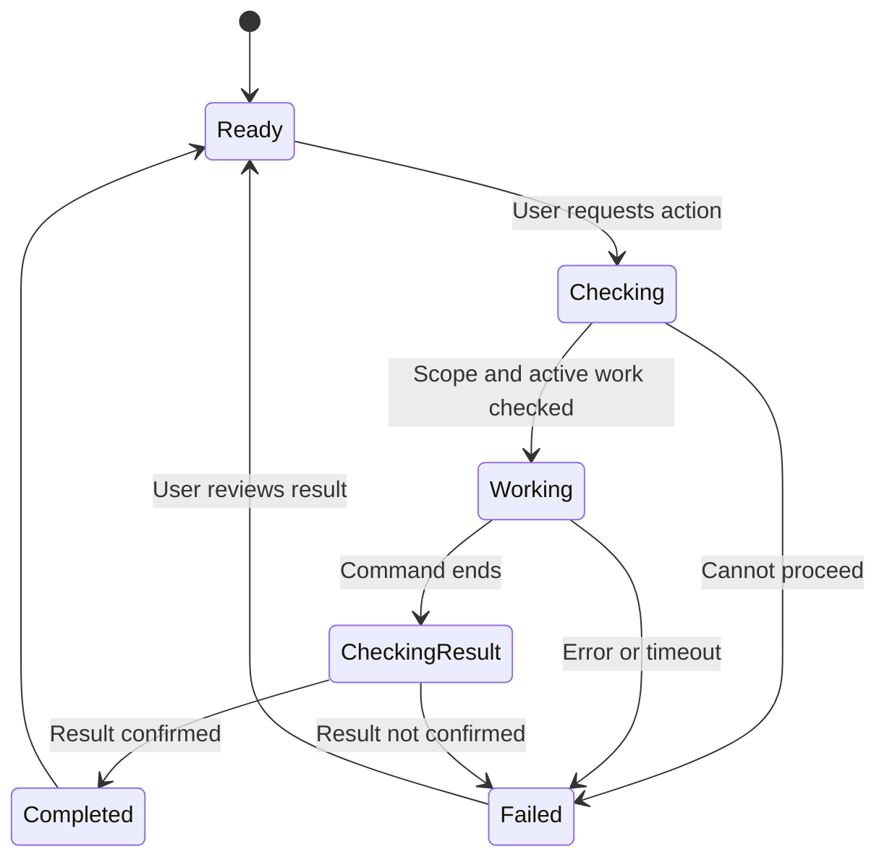

# Timelabs: correct the working controls and settings

Prepared 12 September 2026 for the current Antigravity project, `/Users/sa/scion/omnia-vault`, and its real macOS preference pane in `/Users/sa/scion/OmniaWorkspace/BlueshoesPane`.

## The task in one minute

Correct the existing product. Keep the real menu bar and the real System Settings pane. Remove sample numbers, false success messages, controls that do nothing, and pages that promise features they do not provide. Use simple English. Keep the working SCION setup and the user's reported Gate 4 success.

The first screen should answer three questions: Is my connection working? Are my files safe and moving? Does anything need my attention? If the software cannot answer one of them yet, say **Not checked**, **Not set up**, or **Unavailable**. Do not fill the gap with a green light.

Start with the corrections below. Use the attached inventories to check every existing control, including commands reachable without a button. Finish with evidence from the actual running build and actual System Settings pane. A rewritten walkthrough alone is not completion.

## 1. Keep these decisions

- **Timelabs** is the vendor. macOS is the main workspace. Windows 11/WSL is a helper. Show the actual host affected by an action.
- The installed `Blueshoes.prefPane` is a real System Settings pane. Keep it. The newer Tauri window is a separate app window; it must not be passed off as System Settings. Preserve the installed third-party NDI pane too.
- NDI is a reference for useful tools and clear controls. Video streaming is not part of this correction task. An acceptable name does not establish an implemented feature.
- The file product still includes iCloud Drive, Google Drive, OneDrive, S3/MinIO, Mac and Windows folders, and NAS. Selected folder pairs use two-way sync and keep conflicting versions.
- The private archive covers all user files, with editable exclusions, including Git stashes and untracked work. Keep the user's existing storage and key arrangement as the default when its settings are identified. Use references to stored credentials; never copy real credentials into the repository, examples, logs, or exports.
- Do not call the archive unlimited. Show available space, limits, retention, and cost where known. Do not treat a local database receipt as proof of an encrypted remote backup.
- Automatic care remains in scope for approved, known resources. It must respect active work, sync queues, archive writes, and recovery needs. Fixing the interface does not mean introducing broad automatic deletion.

This task does not require a new routing design, a SCION upgrade, all cloud connectors to be built at once, or an NDI/AI product. Preserve existing work and uncommitted changes. Build the smallest working correction first; record unfinished features honestly.

## 2. Decide whether each function belongs

For every row in `UI_INVENTORY.md`, record its final decision: **Keep**, **Rename**, **Move**, **Remove**, or **Not ready**. A function belongs in the normal interface only when all five answers are clear:

1. What user problem does it solve?
2. What real data or action supports it?
3. What device, files, or connection does it affect?
4. How does the user know it worked or failed?
5. Is this the best place for it, without another copy of the same control?

Remove empty decoration and unsupported claims from the normal interface. Do not build a new subsystem merely to justify an invented label. Removing a button does not remove the command behind it: review Tauri calls and the local control socket separately.

**Specific decisions:** keep measured system information and useful network controls. Remove the cloned NDI runtime page, the static VPN protection page, the nonworking Keep awake switch, and the AI page from this beta's normal navigation. AI is not required for connection, sync, archive, or maintenance; keep any development code separate and do not expose simulated provider replies as working features. Replace the misleading Security & Sync page with real file settings when available; until then show one clear **Not set up** state, without sample jobs. Reduce architecture credits to a short About/Licenses view.

## 3. Fix truth before appearance

### A. Remove invented observations

The active React entry and Rust backend both supply fixed running services, paths, lab devices, traffic, and response times. Failed reads preserve those values. Remove production fixtures from both layers. Use an explicitly marked test mode only for development.

Each observation needs the affected host/resource, collection time, value or error, and source. Use real empty lists. Keep old values only with **Last updated** and a visible stale state. A configured address is not a discovered device. A process ID is not a working remote service. A TCP connection to port 3080 is not a verified GNS3 API response.

Use **Checking**, **On**, **Off**, **Running**, **Stopped**, **Not checked**, **Not set up**, and **Unavailable** only at their stated scope. Show **Connected** only after the relevant connection check passes. Do not use one overall green status to stand in for all of these checks.

### B. Stop turning failures into success

Cleanup, NDI, tunnel, and AI error handlers currently produce success text in some failure cases. Fix these first. Return command exit failures, timeouts, partial results, and access errors. Read back the affected state before reporting success. Keep a failed action visible beside its control, with useful copyable details.

Use one action sequence across the menu, pane, and app: **Check → Working → Check result → Completed or Failed**. Block overlapping changes to the same resource. A delayed old response must not overwrite a newer result. Do slow work away from the UI thread and give child processes a deadline.

### C. Correct connection controls

The same “Valve” labels currently hide different behavior:

- The Tauri Mac control changes the automatic proxy for hardcoded Wi-Fi.
- The Tauri Windows control changes a local GNS3 SSH tunnel service.
- The native pane calls TCP control daemons; the reviewed Mac daemon starts/stops a VM and GNS3, while the reviewed Windows Python file changes a status file.

Identify the deployed implementation before changing it. Label the actual action, target, and effect. Separate **Automatic proxy**, **GNS3 connection**, and **Test machine**. Do not keep a general device switch whose meaning differs between surfaces.

For proxy changes, identify the selected network service, save its prior settings, check command results, read back the effective setting, and restore the saved setting when appropriate. Handle Ethernet and renamed services. Do not claim all traffic is protected because a PAC URL was enabled. Do not stop a VM, service, or transfer from a generic “off” switch. Stop/restart operations must check active work and affect only the owned resource.

### D. Make cleanup narrow and honest

Replace **Wipe Caches** with **Review app files**. Show eligible paths/categories, why they can be removed, and what is excluded. Use the same rules for preview and deletion. Remove the invented minimum of 12 MB.

For manual cleanup, the final action is **Delete selected files**. Previously approved automatic rules may run within their saved scope, with a visible history. Skip active files, unknown owners, transfer queues, current incident logs, and archive work. Follow neither unexpected links nor paths outside the approved scope. Report actual removals and failures; do not count failed deletions or directory-entry sizes as freed storage. Never add a broad home-folder cleanup to satisfy this button.

### E. Check commands without buttons

The app starts a local command server. It exposes cleanup, SSH, AI, a text-only route switch, and a local reboot command. Removing their buttons is not enough. Disable commands without an approved product purpose; apply resource checks to retained commands. Reject missing or malformed fields, secure the local endpoint, identify callers, and bound request size and time. Do not describe a keyword-based text check as permission to execute. See EXTRA_COMMAND_REVIEW.md for the exact paths.

### F. Correct measurements

Keep processor use, memory used, storage, and useful process details. Remove the arbitrary global health score, fake load arithmetic, and “Active cores” label for a core count. Memory use is not memory pressure.

For network speed, use byte differences over measured elapsed time, retain the previous sample, name the included interfaces, and handle resets. Show consistent units. Host-wide network traffic must not be called SCION traffic. Show the actual drive/mount for storage. A missing sample is **Unavailable**, not zero.

## 4. Use simple English everywhere the user works

Apply this to the menu, sidebar, headings, tooltips, alerts, notifications, buttons, empty states, and result messages. Keep SCION, GNS3, NDI, normal provider names, and real identifiers when needed. Put command names and protocol details in **Details**. Required license notices keep their correct names; this is not permission to erase attribution.

| Remove from normal product language | Use instead, only when the function exists |
|---|---|
| Mole Status / Mole Monitor | System / System information |
| Wipe / Purge / Debris | Review app files / Delete selected files |
| Valve A / Cold / Native Cold Stream | Automatic proxy, or the actual VM/service action |
| Valve B / Hot / Hypervisor Hot Stream | GNS3 connection, with its target |
| Blended Multi-Path / Warm Flow | Actual connection status; Routes in Details |
| Kickstart | Restart connection |
| Bare-Metal / Zero-IPC / Native Hybrid Runtime | Remove the slogan; describe the measured function |
| Enterprise / New World Order | Remove |
| SCION Hypervisor / GNS3 Hypervisor | SCION service / GNS3 server, as applicable |
| Hardware-level isolation active | Remove unless a specific protection check supports it |
| Verified Output / Synced to Keiky | Response / actual sync result, when implemented |
| LIT-001 / Rheknel / CAS engine cards | Move verified implementation notes into developer docs |
| Stack & Credits | About |

Do not rename working protocol identifiers or upstream projects to invented friendly names. Do not call a custom terminal script an official SCION command.

## 5. Make the three surfaces work together

**Menu bar:** show a concise status and, optionally, named processor/memory readings. Include **Open settings**, **Open system information**, and **Quit**. Put failures needing attention above routine data. Remove immediate broad cleanup and ambiguous host switches. **Open settings** must open the real Timelabs preference pane. A separate **Open NDI settings** link is optional and must open the installed NDI pane, without claiming to control a stream.

**System Settings:** keep the real pane as the settings surface. Use four simple sections: **Status**, **Files**, **Network**, **Cleanup**. Put About and diagnostic details behind a small secondary control. Use native spacing, readable labels, proper layout constraints/scrolling, and no copied Apple Account card. Keep long logs out of the main view. Replace the Fire L2 button with a clearly scoped **Run connection check** only when it performs a real, documented check; move experimental raw-frame work to developer tools.

**Separate app window:** keep it only for useful detailed activity, file work, or system information. Do not duplicate the full OS sidebar or imply the window is System Settings. Remove dead search and back/forward controls until they work. Keep error text selectable, inputs labelled, keyboard focus visible, and tables usable at the supported minimum window size.

Use one set of state definitions and action results across these surfaces. Reuse existing helpers where suitable; this does not require a new central service or a transport rewrite.

```text
MENU                              REAL SYSTEM SETTINGS
Timelabs                          Timelabs
Connection: Not checked           Status | Files | Network | Cleanup
Last updated: —
                                  Status
Open settings                     This Mac        Checking
Open system information           Windows helper  Not checked
Quit                              Files           Not set up
                                  Needs attention [real issue, if present]
                                  Details…
```

This layout uses states, not invented measurements. It is a content guide for the existing native pane, not a replacement web imitation.



## 6. Align network claims with the original docs

Read `NETWORK_FACTS.md` before changing descriptions or checks. Use the installed versions and their supported commands. Do not upgrade a working lab merely because newer documentation exists.

- SCION gives control over network paths; it does not by itself encrypt all application data or prove user identity. [SCION overview](https://docs.scion.org/en/latest/overview.html)
- GNS3 manages a test network through its controller and computes. A connected server or running device does not prove traffic traversed that device. [GNS3 architecture](https://docs.gns3.com/docs/using-gns3/design/architecture)
- Available paths, selected paths, paths carrying traffic, and a successful website request are separate observations. Do not infer several active paths from two enabled settings. [SCION path checks](https://docs.scion.org/en/latest/command/scion/scion_showpaths.html)
- Current upstream scion-skip supports HTTPS CONNECT and can fall back to ordinary TCP. Do not claim it is HTTP-only. Inspect the installed version and show direct/SCION/unknown route evidence when available. [Pinned scion-skip source](https://github.com/netsec-ethz/scion-apps/blob/6c990ccb5b39fe0f7a23a3d8dcb4528439c3f5c5/skip/main.go)
- Keep the user's Gate 4 report as a reported success. Attach existing results where available. A proxy CONNECT 200, an origin response, and proof of the full traffic route are different facts. The review did not rerun those tests.

## 7. Keep the file work honest

The root app currently has no working provider, folder mapping, conflict, archive, or restore controls. Do not claim that views in the separate `frontend/` directory are part of the current app unless the build actually selects them.

A future **Files** page needs: accounts/locations; selected folder pairs; two-way direction; keep-both conflict handling; pending work; errors; pause/resume; last completed sync; archive status; exclusions; and restore. Show only implemented controls now. Do not silently substitute one-way overwrite rules for the user's chosen default.

Before treating the existing local publication code as the archive, resolve the data-identity, retry, revision, read-verification, durability, encryption, and restore issues in `BACKEND_REVIEW.md`. These are conditions for archive use, not a demand to rebuild the archive during the UI cleanup. No success receipt should authorize deleting the source until the agreed protection is verified.

## 8. Finish with evidence

1. Record the active source tree, build version/revision, actual app path, and installed pane version. Preserve existing changes. Correct root `src/App.tsx` / `src/index.css`, not the unused stylesheet or an unselected frontend.
2. Remove unsupported pages/claims and false success paths. Fix retained actions and observations. Update the real pane, menu, and app together.
3. Test all retained controls using the cases in `REVIEW_SCOPE.md`; use fixtures for failures and active-file safety. Do not disrupt ongoing transfers to produce screenshots. Run the relevant existing build/check commands. Test Windows-specific claims on Windows/WSL; a Mac build is not that evidence.
4. Launch the corrected build and open the actual System Settings pane. Check keyboard operation, readable narrow layouts, stale/error/empty states, and menu destinations. Identify the running build in the evidence.
5. Return a short change list, the completed Keep/Rename/Move/Remove/Not ready inventory, checks run with results, and remaining limits. Include screenshots of the real surfaces. Do not mark a test passed because code compiled, a string was printed, or a plan was written.

Acceptance is local correction and a verified handoff. Publishing an app release or changing the live network is not needed to complete this review task. The user separately requested a documentation update to omnia-playbook. Do not repeat the earlier unsupported claim that all VPN requirements have been eliminated.

## Supporting files

- `UI_INVENTORY.md` — every current route, control, field, display group, and menu item.
- `NATIVE_PANE_REVIEW.md` — actual System Settings behavior and its different control paths.
- `BACKEND_REVIEW.md` — registered commands, results, cleanup, metrics, and archive-use limits.
- `EXTRA_COMMAND_REVIEW.md` — AI and local-socket behavior, including actions reachable without UI buttons.
- `NETWORK_FACTS.md` — quick perspective and deeper checks from upstream docs/source.
- `REVIEW_SCOPE.md` — coverage, evidence limits, and acceptance cases.

Where an appendix offers a broader optional feature, the smaller beta scope in this task takes priority.
